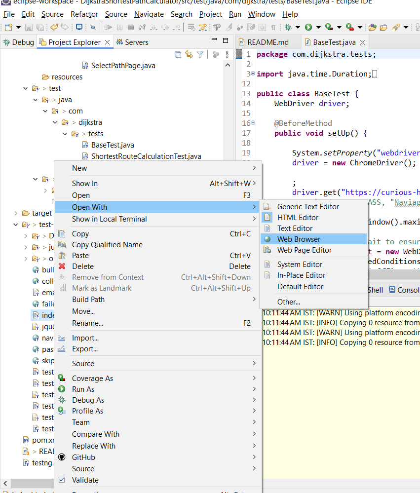

# DijkstraShortestPathCalculator

# Shortest Route Optimizer Test Automation

This project contains automated end-to-end (E2E) tests for the Shortest Route Optimizer application. The tests are implemented using Selenium with Java and follow the Page Object Model (POM) design pattern.

## Prerequisites

- Java Development Kit (JDK) 11 or later
- Apache Maven
- Google Chrome browser
- ChromeDriver (compatible with your version of Chrome)
- Eclipse IDE with TestNG plugin installed

## Configuration

1. **Set Up ChromeDriver Path:**

   Ensure the `chromedriver.exe` path is correctly set in the ``file located in`src/tests/BaseTest.java`.

   ```properties
   chromedriver.path=src/test/resources/chromedriver.exe
   ```

## Install Maven Dependencies:

Navigate to the project directory and run the following command to install the required dependencies:

mvn clean install

## Running Tests

- Running Tests from Eclipse
  Import the Project:

Open Eclipse.
Go to File > Import > Existing Maven Projects.

Select the root directory of your project and click Finish.

Set Up TestNG:

Ensure that the TestNG plugin is installed in Eclipse. If not, go to Help > Eclipse Marketplace, search for TestNG, and install it.
Execute Tests:

In the Project Explorer or Package Explorer view, navigate to the test class (/DijkstraShortestPathCalculator/src/test/java/com/dijkstra/tests/ShortestRouteCalculationTest.java).

Right-click on the test class file.

Select Run As > TestNG Test.

## Test Reports

After running the tests, Maven Surefire plugin generates test reports.

- Locate the Reports:

The reports are generated in the /test-output directory.

- Open the Report:

Open the index.html file in a web browser to view the test results.


